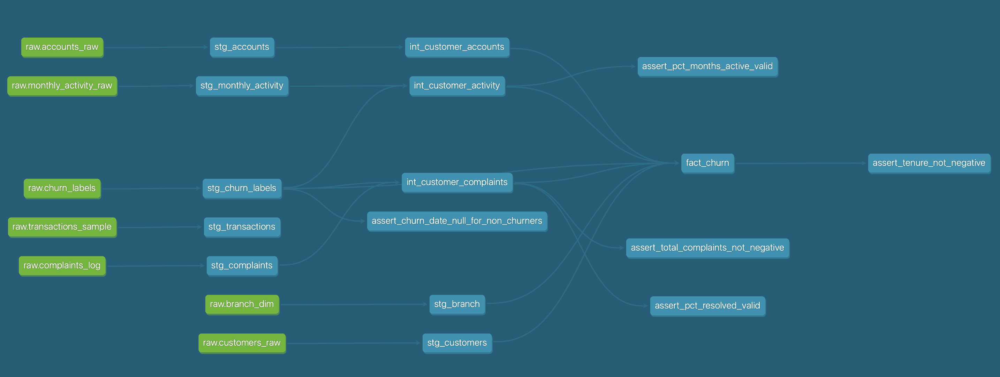
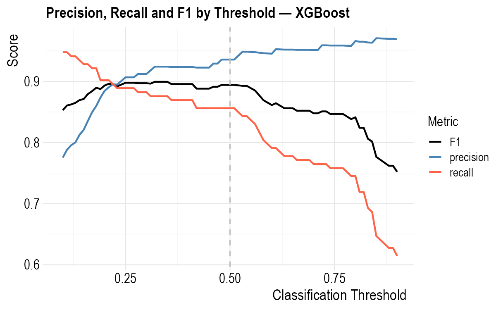
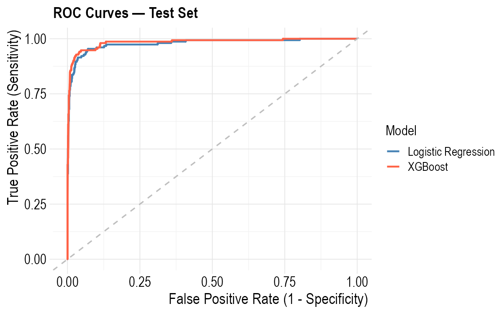
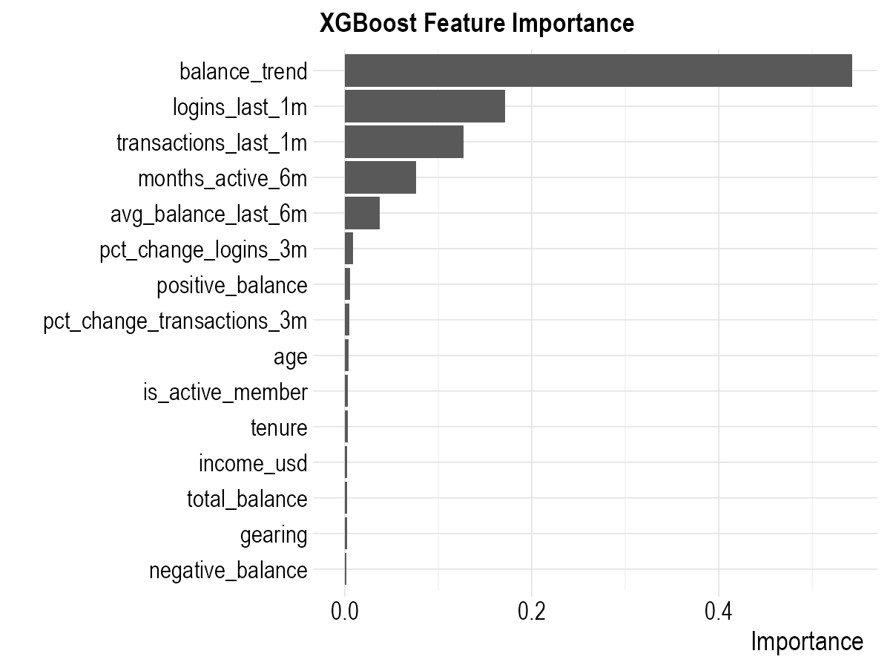
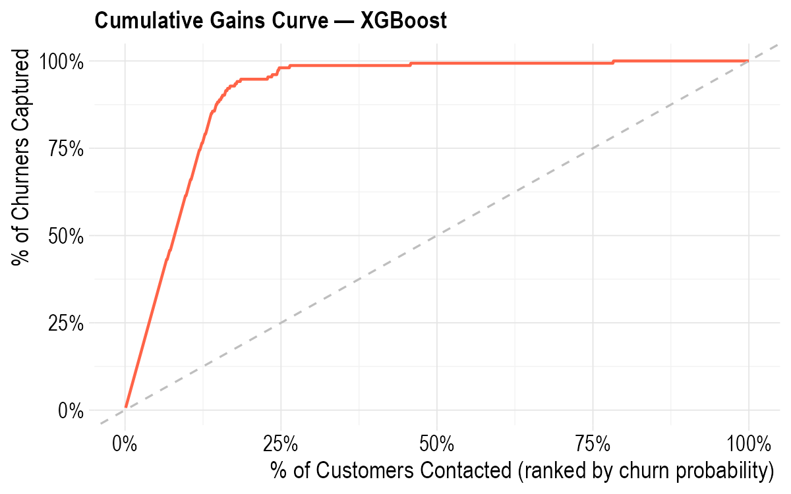

# Bank Customer Churn Prediction

An end-to-end data science project simulating a real-world bank churn 
prediction pipeline — from raw data ingestion to machine learning modeling.

## Tech Stack

| Layer | Tools |
|---|---|
| Data simulation | Python (numpy, pandas) |
| Data ingestion | R (bigrquery) |
| Data warehouse | Google BigQuery |
| Data modeling | dbt (staging → intermediate → marts) |
| Machine learning | R (tidymodels, XGBoost, glmnet) |
| Version control | Git / GitHub |

## Project Structure
```
bank-churn-project/

├── data/raw/               # Simulated raw CSV files (7 tables)

│   ├── generate_data.py    # Synthetic data generation

├── dbt_bank_churn/         # dbt project

│   └── models/

│       ├── staging/        # Cleaned source tables (7 models)

│       ├── intermediate/   # Aggregated features (3 models)

│       └── marts/          # Final feature table (fact_churn)

└── scripts/

    ├── load_to_bigquery.R  # Raw data ingestion to BigQuery

    └── churn_modeling.R    # ML modeling pipeline
```


## Data Lineage

The dbt pipeline builds 11 models across 3 layers — from raw BigQuery 
sources through to the final `fact_churn` feature table.



> Full interactive documentation: [dbt docs](https://ccappelen.github.io/churn-project/)

--- 

## Dataset

The dataset is synthetically generated to reflect the kind of multi-table, 
messy data a data scientist would encounter in a real banking environment. 
It consists of 7 relational tables covering 5,000 customers:

| Table | Grain | Description |
|---|---|---|
| `customers_raw` | 1 row per customer | Demographics, income, tenure |
| `accounts_raw` | 1 row per account | Account types and balances |
| `monthly_activity_raw` | 1 row per account per month | **Panel data** — 12 months of balances, transactions, logins |
| `complaints_log` | 1 row per complaint | Customer service interactions |
| `transactions_sample` | 1 row per transaction | Individual transactions for a sample of 1,200 customers |
| `branch_dim` | 1 row per branch | Branch reference table (20 US branches) |
| `churn_labels` | 1 row per customer | Target variable — churned (0/1) and churn date |

**Deliberate data quality issues** were introduced to simulate real-world 
source systems: inconsistent gender encodings (`M`, `Male`, `male`, `MALE`), 
mixed date formats across 5 different conventions, duplicate customer rows 
with slightly different income values (simulating re-extraction), balance 
columns stored as mixed strings (`"USD 1,234.56"`, `"1 234.56"`, `"N/A"`), 
and ~8% missing income values.

The `churn_labels` table is kept deliberately separate from the feature 
tables — reflecting real-world setups where the target variable often 
lives in a different system (e.g. CRM) than the feature data.

--- 

## Pipeline

### 1. Data Generation

`generate_data.py` simulates all 7 raw CSV files with a fixed random seed 
for reproducibility. Churn behavior is driven by a latent risk score based 
on customer inactivity, number of products, tenure, age, and a non-linear 
income interaction — designed so that behavioral features (activity, balance 
trend) are more predictive than demographic features, which reflects 
real-world churn dynamics.

### 2. Data Ingestion

`load_to_bigquery.R` uploads all 7 CSVs to a `raw` dataset in BigQuery, 
loading every column as `STRING` to preserve the source messiness. Type 
casting and cleaning are handled downstream in dbt — not at ingestion — 
which is the standard approach in modern data pipelines.

### 3. dbt Modeling

The dbt pipeline transforms raw data into a clean, analysis-ready feature 
table through three layers:

**Staging** — one model per source table, handling all data quality issues:
- Standardized gender encodings (14 variants → Male/Female/Other)
- Multi-format date parsing (`COALESCE` of 5 `SAFE.PARSE_DATE` formats)
- Balance string cleaning (`REGEXP_REPLACE` to strip currency prefixes, 
  comma/space thousands separators, and `N/A` values)
- Deduplication of customer rows using `ROW_NUMBER()` with tenure as tiebreaker

**Intermediate** — one model per feature domain, aggregating to one row 
per customer:
- `int_customer_accounts` — account-level features (number of accounts, 
  total debt, positive balance, debt-to-asset ratio)
- `int_customer_complaints` — complaint features (count, resolution rate, 
  satisfaction score with median imputation, days since last complaint)
- `int_customer_activity` — panel data aggregations using time-windowed 
  conditional aggregation (last 1 month, last 3 months, last 6 months)

**Marts** — `fact_churn` joins all intermediate models onto `stg_customers`, 
producing a single feature table with one row per customer and 40+ features.

The pipeline includes **43 data quality tests** (uniqueness, not-null, 
accepted values, referential integrity, and custom singular tests) that 
run automatically with every `dbt build`.

### 4. Feature Engineering

**Leakage prevention** is the most critical feature engineering decision. 
A `feature_cutoff_date` is defined per customer:
- Churned customers: 2 months before churn date
- Non-churned customers: snapshot date (2024-12-31)

This ensures no behavioral data from the churn period itself is used as 
a predictor — a common and subtle source of data leakage in churn models.

**Key engineered features:**
- `balance_trend` = `avg_balance_last_3m - avg_balance_last_6m` — captures 
  whether a customer's balance is declining, which is a stronger signal 
  than either average alone and avoids multicollinearity
- `tenure` — recalculated using `feature_cutoff_date` rather than the 
  snapshot date, since the original `tenure_months` was calculated to 
  December 2024 for all customers including those who churned earlier

**Features excluded from modeling:**
- `pct_change_balance_3m` — despite the cutoff, this feature was still 
  capturing balance drawdown in the pre-churn period, producing near-perfect 
  model AUC (leakage indicator)
- `logins_last_3m`, `transactions_last_3m` — high correlation (0.61) with 
  their 1-month equivalents; 1-month versions retained as more recent signal
- `pct_months_active_6m` — perfectly correlated (1.00) with `months_active_6m`
- `days_since_last_complaint` — 88.8% missing; `has_complaint` flag captures 
  the same information more completely

---

## Exploratory Data Analysis

Before modeling, feature distributions were examined by churn status to 
understand which variables show separation between churned and retained 
customers.


Key observations:
- **Login and transaction activity** show the strongest visual separation — 
  churned customers have a large spike at zero, reflecting disengagement 
  before exit
- **Average balance** is lower for churned customers, consistent with 
  the balance drawdown built into the data generating process
- **Tenure** shows no visible separation — despite being a risk factor 
  in the data generation, its effect is weak relative to behavioral features

---

## Modeling

Two models were built using the `tidymodels` framework in R:

**LASSO Logistic Regression** (`glmnet`) — chosen as an interpretable 
baseline. The L1 penalty performs automatic feature selection by shrinking 
uninformative coefficients to zero, which is useful given the 40+ feature 
set.

**XGBoost** (`xgboost`) — gradient boosted trees, capable of capturing 
non-linear relationships and feature interactions that logistic regression 
cannot. Hyperparameters tuned via 5-fold cross-validation using a 
space-filling grid of 20 combinations.

Both models use the same preprocessing recipe:
- Median imputation for numeric NULLs
- Mode imputation for categorical NULLs
- Dummy encoding for categorical variables
- Normalization (centering and scaling) — required for logistic regression, 
  harmless for XGBoost

**Threshold tuning:** the default classification threshold of 0.50 was 
lowered to 0.32 for XGBoost. In a churn context, missing a churner 
(false negative) is more costly than a false alarm (false positive), 
so optimizing for recall at a small precision cost is the right business 
decision. The optimal threshold was selected by maximizing F1 score 
across thresholds from 0.10 to 0.90.



---

## Results

### Model Comparison

| Metric | Logistic Regression | XGBoost (threshold = 0.32) |
|---|---|---|
| ROC-AUC | 0.979 | 0.984 |
| PR-AUC | 0.936 | 0.950 |
| F1 | 0.835 | 0.899 |
| Precision | 0.950 | 0.924 |
| Recall | 0.745 | 0.876 |



XGBoost outperforms Logistic Regression on recall (0.876 vs 0.745) and 
F1 (0.899 vs 0.835) — catching significantly more churners at a small 
precision cost. For a bank retention campaign where the cost of missing 
a churner exceeds the cost of a false retention offer, XGBoost is the 
preferred model.

Logistic Regression achieves higher precision (0.950 vs 0.924) — useful 
if the business wants to contact only the highest-confidence churners 
with a premium retention offer.

### Feature Importance




Both models agree on the top predictors: `balance_trend`, `logins_last_1m`, 
`transactions_last_1m`, and `months_active_6m` — all behavioral engagement 
features. Demographic features (age, income, tenure) contribute modestly 
but are not primary drivers, which is consistent with real-world churn 
research.

### Lift Analysis



| Decile | Churn Rate | Lift | Cumulative Churners Captured |
|---|---|---|---|
| 1 (top 10%) | 97% | 6.3x | 63% |
| 2 | 49% | 3.1x | 95% |
| 3 | 6% | 0.4x | 99% |
| 4-10 | ~0% | ~0x | 100% |

By targeting only the **top 20% of customers** ranked by predicted churn 
probability, the model captures **95% of all churners** — a 4-6x 
improvement over random targeting. This directly translates into reduced 
retention campaign costs while maintaining near-complete coverage of 
at-risk customers.

---